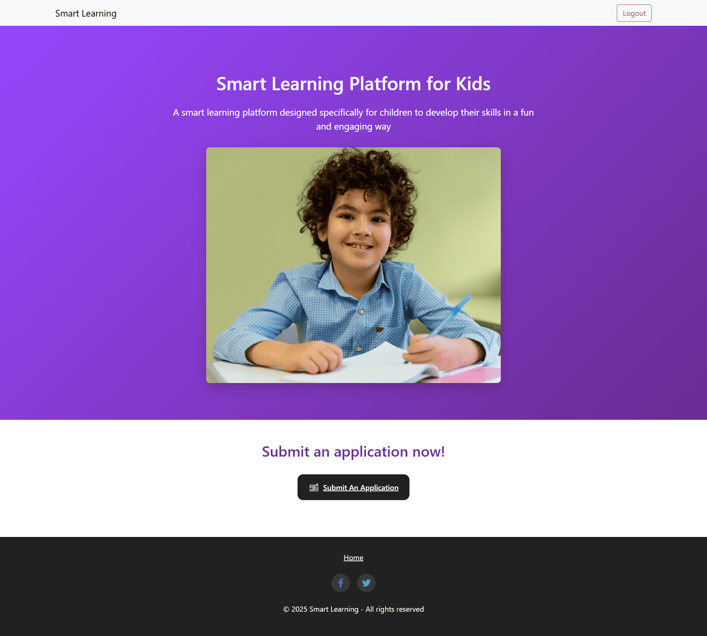
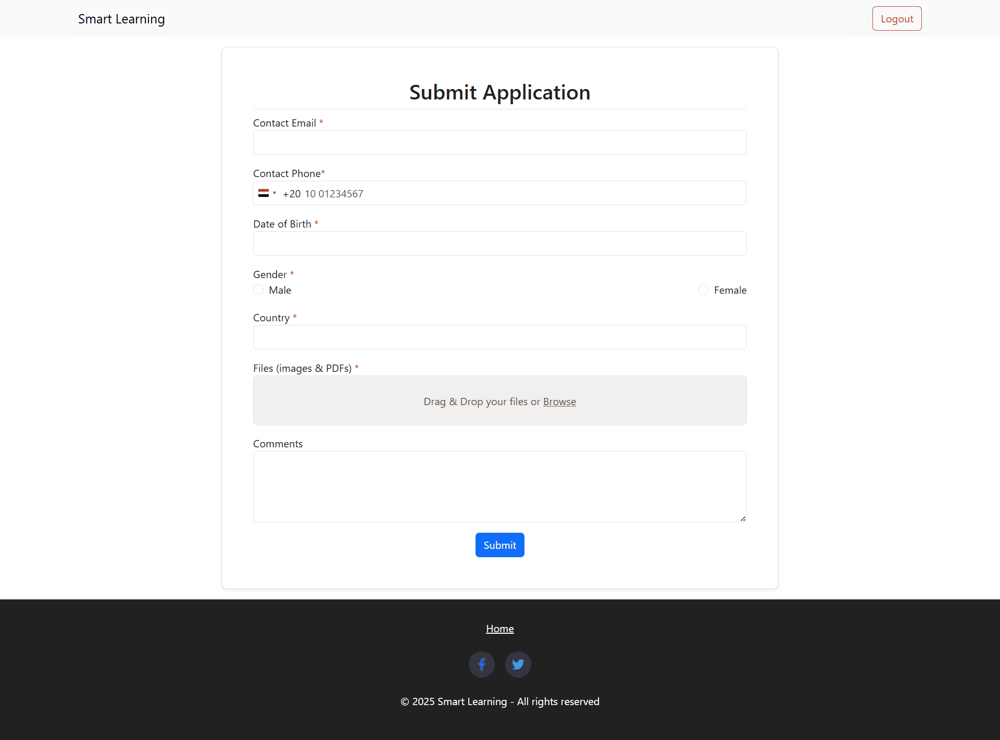
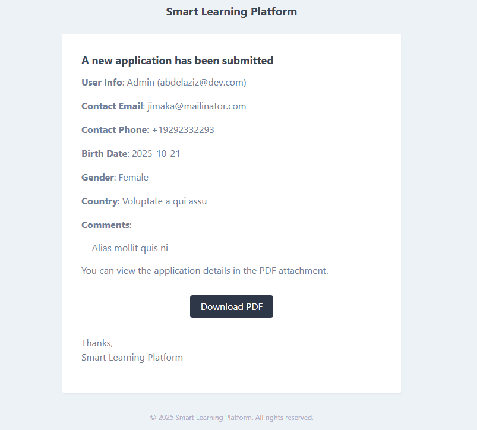

## 🛠️ Installation Guide

### 🔹 **Step 1: Clone the Repository**
```sh
git clone https://github.com/abdelazizib/gec-task
cd gec-task
```

### 🔹 **Step 2: Install Dependencies**
```sh
composer install
```

### 🔹 **Step 3: Environment Setup**
```sh
cp .env.example .env
php artisan key:generate
```
Update `.env` with database credentials.

### 🔹 **Step 4: Mail Configuration**
Configure your mail settings in `.env` file to enable email functionality:
**For Mailtrap (Testing):**
```env
MAIL_MAILER=smtp
MAIL_HOST=sandbox.smtp.mailtrap.io
MAIL_PORT=2525
MAIL_USERNAME=your-mailtrap-username
MAIL_PASSWORD=your-mailtrap-password
MAIL_ENCRYPTION=tls
```

### 🔹 **Step 5: Database Configuration**
```sh
php artisan migrate
```
### 🔹 **Step 6: Setup Storage**
```sh
php artisan storage:link
```
### 🔹 **Step 7: Run the Application**
```sh
php artisan serve --port=991
```
🔗 Open `http://127.0.0.1:991`

## 📸 Screenshots

### 🏠 **Homepage Layout**

*Main landing page with application form*

### 📝 **Application Form**

*User application submission form*

### 📧 **Email Templates**

*Application confirmation email layout*

### 📄 **PDF Generation**

*Generated PDF application document*